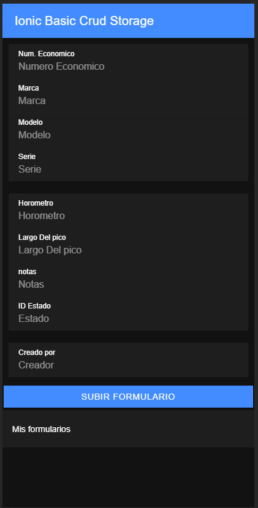

1.  ionic start  ionicStorageCrud blank --type=angular
2.  ionic g service services/storage
3.  npm i @ionic/storage
4.  ionic cordova plugin add cordova-sqlite-storage
5.  Import IonicStorageModule.forRoot() in app.module from @ionic/storage
6.  

| col 1      | col 2      |
|------------|-------------|
|  | image 2 |